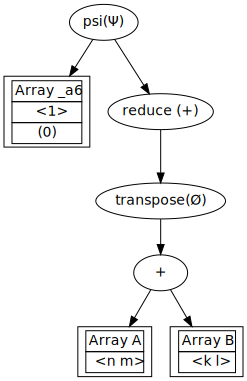
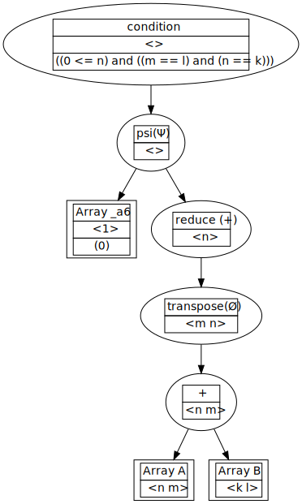
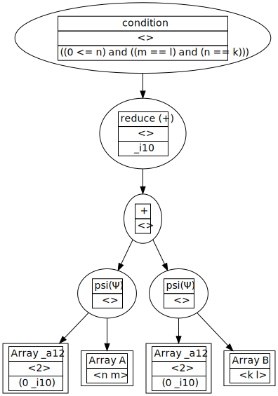

Introduction
============

Python-moa (mathematics of arrays) is an approach to a high level
tensor compiler that is based on the work of `Lenore Mullins
<https://www.albany.edu/ceas/lenore-mullin.php>`_ and her
`dissertation
<https://www.researchgate.net/publication/308893116_A_Mathematics_of_Arrays>`_. It
is trying to solve many of the same problems as other technologies
such as the `taco compiler <http://tensor-compiler.org/>`_ and the
`xla compiler <https://www.tensorflow.org/xla>`_. However, it takes a
much different approach than others guided by the following
principles.

1. What is the shape? Everything has a shape. scalars, vectors, arrays, operations, and functions.

2. What are the given indicies and operations required to produce a given index in the result?

Having a compiler that is guided upon these principles allows for high
level reductions that other compilers will miss and allows for
optimization of algorithms as a whole. Keep in mind that MOA is
**NOT** a compiler. It is a theory that guides compiler
development. Since `python-moa
<https://github.com/Quansight-Labs/python-moa>`_ is based on theory we
get unique properties that other compilers cannot guarantee.

 - No out of bounds array accesses
 - A computation is determined to be either valid or invalid at compile time
 - The computation will always reduce to a deterministic minimal form (dnf)
   (see `church-rosser
   <https://en.wikipedia.org/wiki/Church%E2%80%93Rosser_theorem>`_
   property)
 - All moa operations are composable (including black box functions)
 - Arbitrary high level operations will compile down to a minimal
   backend instruction set. If the shape and indexing of a given
   operation is known it can be added to python-moa.

Frontend
--------

Lenore Mullins originally developed a `moa compiler
<https://github.com/saulshanabrook/psi-compiler/>`_ in the 90's with
programs that used a symbolic syntax heavily inspired by `APL
<https://en.wikipedia.org/wiki/APL_(programming_language)>`_ (`example
program
<https://github.com/saulshanabrook/psi-compiler/blob/master/examples/ex1.m>`_). This
work was carried into python-moa initially with a lex/yacc compiler
with an example program below.

.. code-block:: python

   from moa.frontend import parser

   context = parser.parse('<0> psi (+red (tran (A ^ <n m> + B ^ <k l>)))')

Upon pursuing this approach it became apparent that MOA should not
require that a new syntax be developed since it is only a theory! So a
pythonic interface to MOA was developed that expressed the same ideas
which look much like the current numeric python libraries.

.. code-block:: python

   from moa.frontend import LazyArray

   A = LazyArray(shape=('n', 'm'), name='A')
   B = LazyArray(shape=('k', 'l'), name='B')

   expression = (A + B).T.reduce('+')[0]
   expression

Shape Calculation
-----------------

The shape calculation is responsible for calculating the shape at
every step of the computation. This means that operations have a
shape. Note that the compiler handles symbolic shapes thus the exact
shape does not need to be known, only the dimension. After the shape
calculation step we can guarantee that an algorithm is a valid program
and there will be no out of bound memory accesses. Making MOA
extremely compelling for FPGAs and compute units with a minimal OS. If
an algorithm makes it past this stage and fails then it is an issue
with the compiler not the algorithm.

.. code-block:: python

   >>> expression.visualize(stage='shape')

Denotational Normal Form (DNF)
------------------------------

The DNF's responsibility is to reduce the high level MOA expression
the minimal and optimal machine independent computation. This graph
has all of the indexing patterns of the computation and resulting
shapes. Notice that several operations disappear in this stage such a
transpose because transpose is simply index manipulation.

.. code-block:: python

   >>> expression.visualize(stage='dnf')

Operational Normal Form (ONF)
-----------------------------

The ONF is the stage of the compiler that will have to be the most
flexible. At its current stage the ONF is a naive compiler that does
not perform many important optimizations such as `PSI reduction
<https://www.researchgate.net/publication/264758384_Effective_data_parallel_computation_using_the_Psi_calculus>`_
which reduces the number of loops in the calculation, loop ordering,
and minimize the number of accumulators. MOA has ideas of dimension
lifting which make parallization and optimizing for cache sizes much
easier. Additionally algorithms must be implemented differently for
sparse, column major, row major. The ONF stage is responsible for an
"optimal" implementation. "optimal" will vary from user to user and
thus will have to allow for multiple programs: optimal single core,
optimal parallel, optimal gpu, optimal low memory, etc.

.. code-block:: python

   >>> print(expression.compile(use_numba=True, include_conditions=False))
   @numba.jit
   def f(A, B):
       n = A.shape[0]
       m = A.shape[1]
       k = B.shape[0]
       l = B.shape[1]

       _a21 = numpy.zeros(())
       _a19 = numpy.zeros(())

       _a21 = 0
       for _i10 in range(0, m, 1):
           _a21 = (_a21 + (A[(0, _i10)] + B[(0, _i10)]))
       _a19[()] = _a21
       return _a19

Performance
-----------

MOA excels at performing reductions and reducing the amount of actual
work done. You will see that the following algorithm only requires the
first index of the computation. Making the naive implementation
``1000x`` more expensive for ``1000x1000`` shaped array. The following
benchmarks have been performed in my laptop with an intel
i5-4200U. However, more benchmarks are always available on the `Travis
CI <https://travis-ci.org/Quansight-Labs/python-moa>`_ (these
benchmarks test python-moa's weaknesses). You will see with the
benchmarks that if **any** indexing is required MOA will be
significantly faster unless you hand optimize the numerical
computations.

.. code-block:: python

   import numpy
   import numba

   n, m = 1000, 1000

   exec(expression.compile(backend='python', use_numba=True, include_conditions=False))

   A = numpy.random.random((n, m))
   B = numpy.random.random((n, m))

Here we execute the MOA optimized code with the help of `numba
<https://github.com/numba/numba>`_ which is a JIT LLVM compiler for
python.

.. code-block:: python

   %%timeit

   >>> f(A=A, B=B)
   2.21 µs ± 36.6 ns per loop (mean ± std. dev. of 7 runs, 100000 loops each)

The following numpy computation is obviously the worst case expression
that you could write but this brings up the point that often times the
algorithm is expressed differently than the implementation. This is
one of the problems that MOA hopes to solve.

.. code-block:: python

   %%timeit

   >>> (A + B).T.sum(axis=0)[0]
   2.68 ms ± 127 µs per loop (mean ± std. dev. of 7 runs, 100 loops each)

We notice that even with the optimized version MOA is faster. This is
mostly due to the transpose operation the numpy performs that we have
no way around.

.. code-block:: python

   %%timeit

   >>> (A[0] + B[0]).T.sum(axis=0)
   6.92 µs ± 157 ns per loop (mean ± std. dev. of 7 runs, 100000 loops each)

Conclusion
----------

I hope that this walk through has shown the promising results that MOA
theory can bring to tensor computations and the python ecosystem as a
whole. Please feel free to try out the project at `Quansight
Labs/python-moa <https://github.com/Quansight-Labs/python-moa>`_. I
hope that this work can allow for the analysis and optimization of
algorithms in a mathematically rigorous way which allows users to
express their algorithms in an implementation independent manner.
